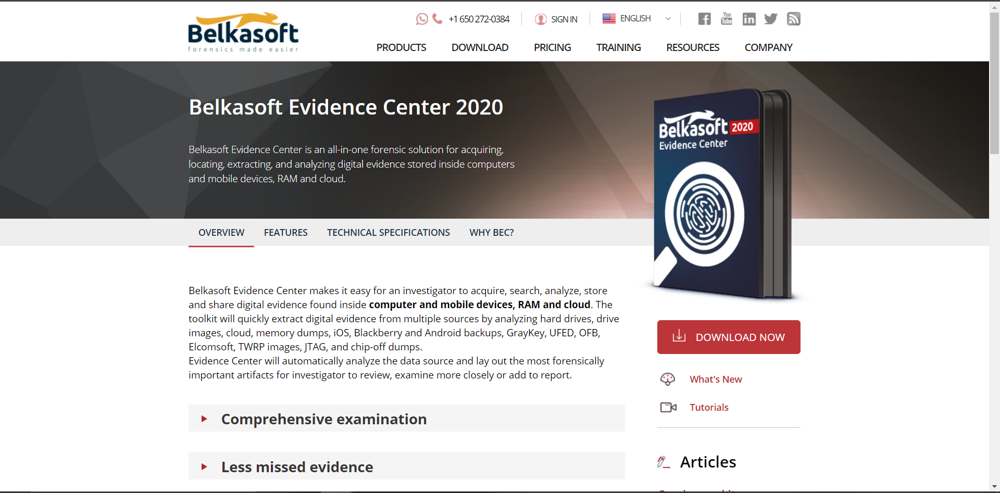
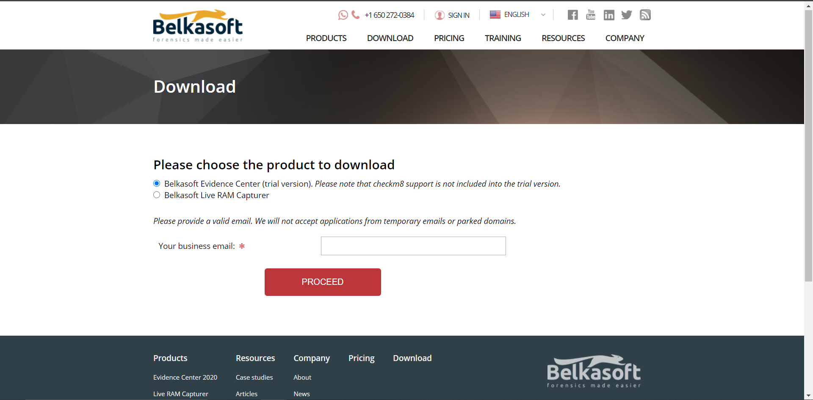
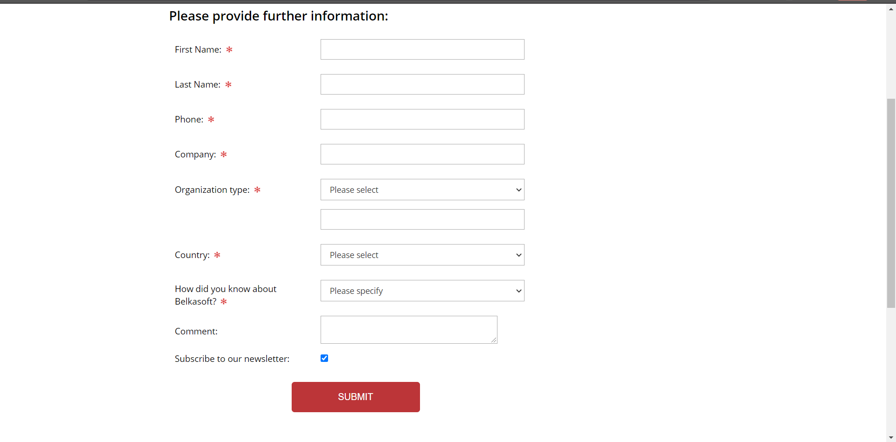
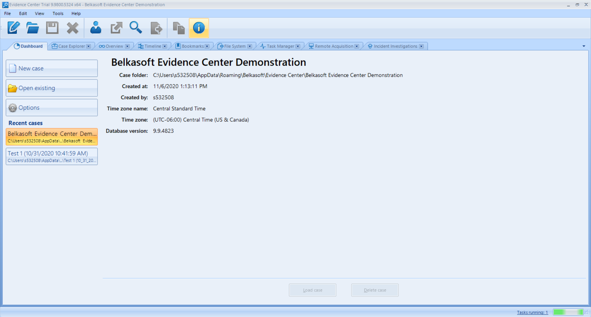
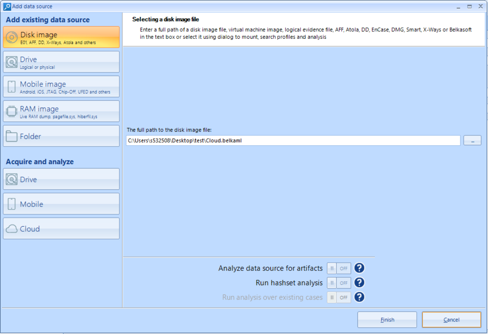
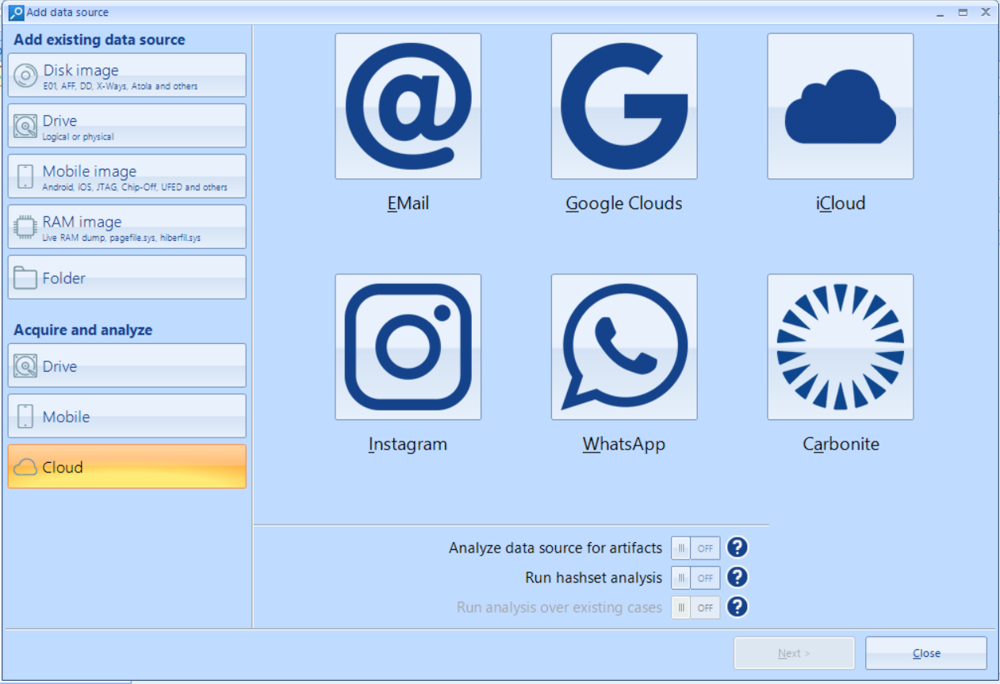
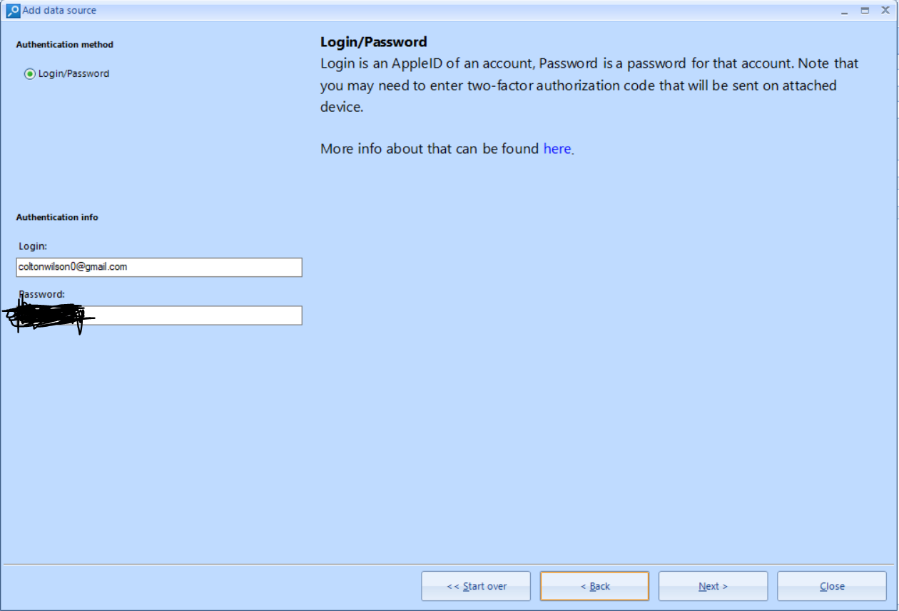
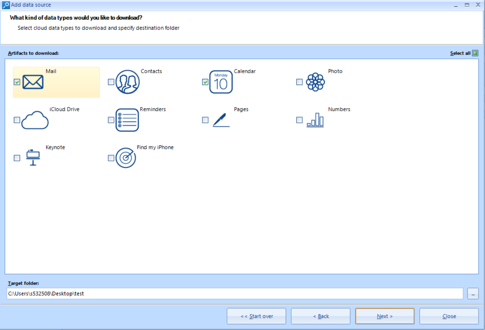

# Digital-Forensics-Demonstration-Number-8
This is a repo for the Digital Forensics class at Northwest Missouri State University. It is specifically for Demonstration Number 8, involving working with the Belkasoft Evidence Center. The specific topic for the demonstration is the cloud while using Belkasoft. 

Welcome!
My name is Colton Wilson and I am a junior at Northwest Missouri State University. Above is a little description of what this repository was created for. The rest of the ReadMe will contain the steps I took in exploring the Belkasoft Evidence Center and what it is about.

## Step 1: Downloading Belkasoft Evidence Center
The first step is to download the evidence center software itself. To start, go to the following link to download the software: https://belkasoft.com/ec. This is the page you will land on: 

The next thing to do is to click on the "Download Now" box on the right of the screen. The next screen you will be taken to is this: 

After you enter in your business email, the last screen you will be taken to is this: 

This screen asks for your information so Belkasoft can create a request to download their software. After you enter the necessary information, the company will process your information and approve or deny your request for the download within one business day. 

## Step 2: Acquiring Cloud Data using Belkasoft Evidence Center
Once you have downloaded Belkasoft Evidence Center from the email sent to you containing the file, open the program and it will take you to the home screen. 

After you create a new case, the drive acquisiton screen will pop up where you can choose what type of drive to acquire. In this case, we will be focusing on the cloud tab.  

Then you are able to choose from a variety of different options from Email to Google/Apple clouds and others as shown in the photo. For this demonstration, we will be looking at the Apple iCloud. 

Once you input the email and password you have (I used mine for the demonstration so my password is blacked out) you are then asked to choose what specific data you want to acquire.  

After that, you will click next and all the data that you selected will be acquired! You then are able to use the data however you need to in order to acquire the necessary information needed!

### Sources
https://belkasoft.com/get 
https://belkasoft.com/tutorials 
